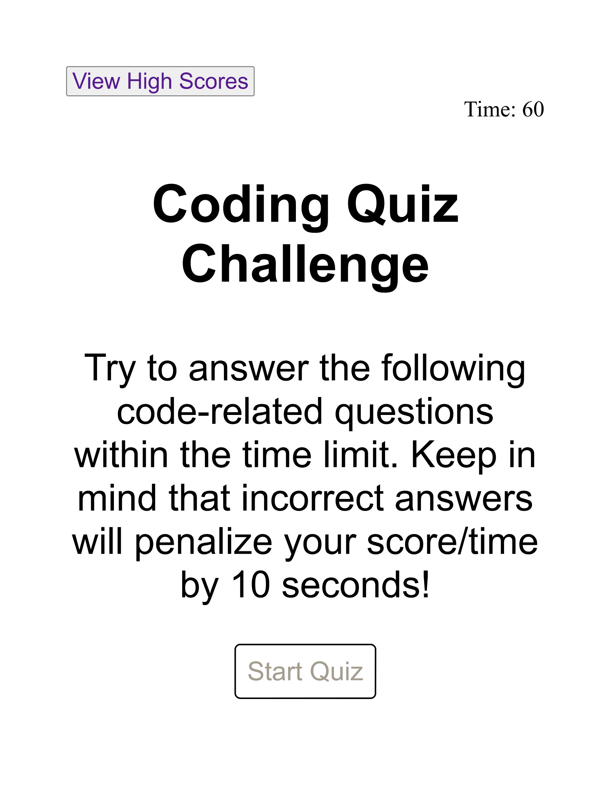

# Javascript Code Quiz 
Code Quiz Challenge

## Description
The purpose of this project was to build a javascript code quiz usingHTML, CSS, and Javascript. This quiz contains a timed trivia challenge for the user, and then gives a score based on performance. This project also utilizes local storage to display player initials. 

## Installation
In order to run this project a user must open the html file in their browser. Then click 'start quiz'. 

## Usage
Once the game has started the timer will countdown from 60 seconds and they will be prompt with the first question. After answering all 5 questions they will recieve their score.

Deployed Project:

## License
N/A